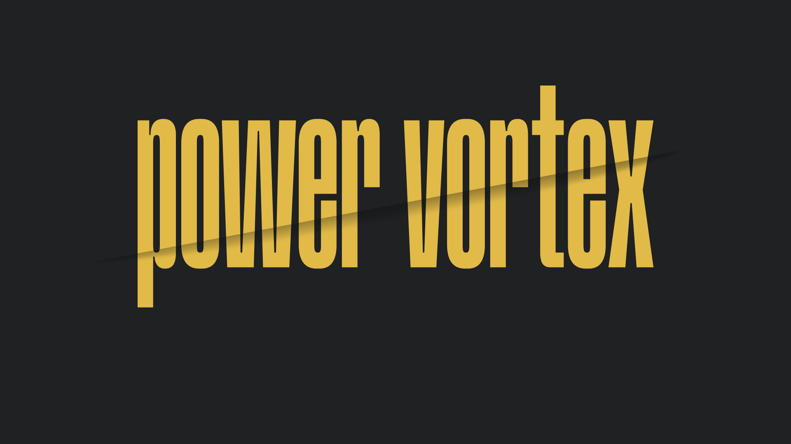

# Power Vortex - Home Energy Management System

Explore the design and comprehensive presentation by visiting <a href="[bit.ly/powervortex](https://www.figma.com/proto/cLRI4ejaeHC0zH7isuGuYN/Presentation?page-id=299%3A23807&type=design&node-id=299-23826&viewport=1335%2C1603%2C0.14&t=TeU0LRRjSZZ00Frw-1&scaling=min-zoom&starting-point-node-id=299%3A23808&show-proto-sidebar=1)">Click here!<a>.

Power Vortex is an innovative home energy management system that enables users to optimize power consumption and promote sustainable energy practices. With real-time insights, remote control, and centralized data storage, Power Vortex empowers users to efficiently manage their appliances and reduce energy wastage.

## Features

- **Real-time Power Monitoring:** Monitor energy consumption of connected appliances in real-time through the mobile app.
- **Remote Device Control:** Turn appliances on or off remotely to manage power usage from anywhere.
- **Energy Usage Insights:** Access detailed historical energy consumption patterns for informed decision-making.
- **Scheduling Capabilities:** Schedule appliance usage to ensure optimal energy consumption and cost efficiency.
- **Centralized Data Storage:** All power consumption data is securely stored on our server for easy access and tracking.

## Future Scope

The future scope of the Power Vortex project includes the following enhancements:

- **Machine Learning Integration:** Integrate machine learning algorithms to provide more sophisticated insights, personalized energy-saving recommendations, and predictive analytics for users.

## Contributions

- [Adithya Anil](https://github.com/unidreamerzz007)
- [Ashwin A](https://github.com/Ashwin-Achu)
- [Gopal S](https://github.com/gopalshibu142)
- [Shibin Shibu](https://github.com/shibinshibu01)

## License

This project is licensed under the [MIT License](LICENSE.md).

---
